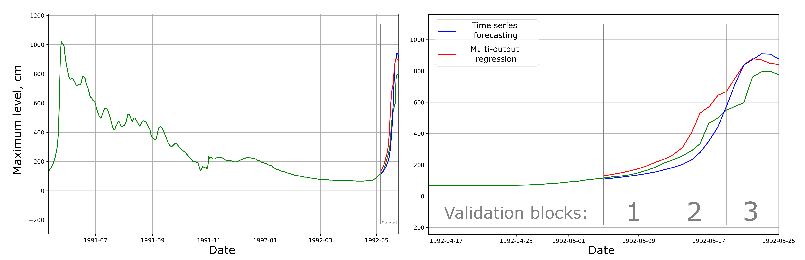

# emergency_datahack_nss
 

The repository contains the data of the NSS lab team for the hackathon "Emergency DataHack 2021". 
The task was to predict changes in the water level in rivers during high water. 

There were implemented ensemble model with several blocks:
* Preprocessing
    - Interpolation
    - Filling in the gaps
* Modelling
    - Time series forecasting 
    - Multioutput regression
    - Physical modelling 

Example of forecasts, obtained from "Time series forecasting" model (blue line) and "Multioutput regression" model (red line) can be seen at the plot:

The [FEDOT](https://github.com/nccr-itmo/FEDOT) framework was used for forecasting.  
The main concept of the approach can be seen at the picture above.

The team took the first place.